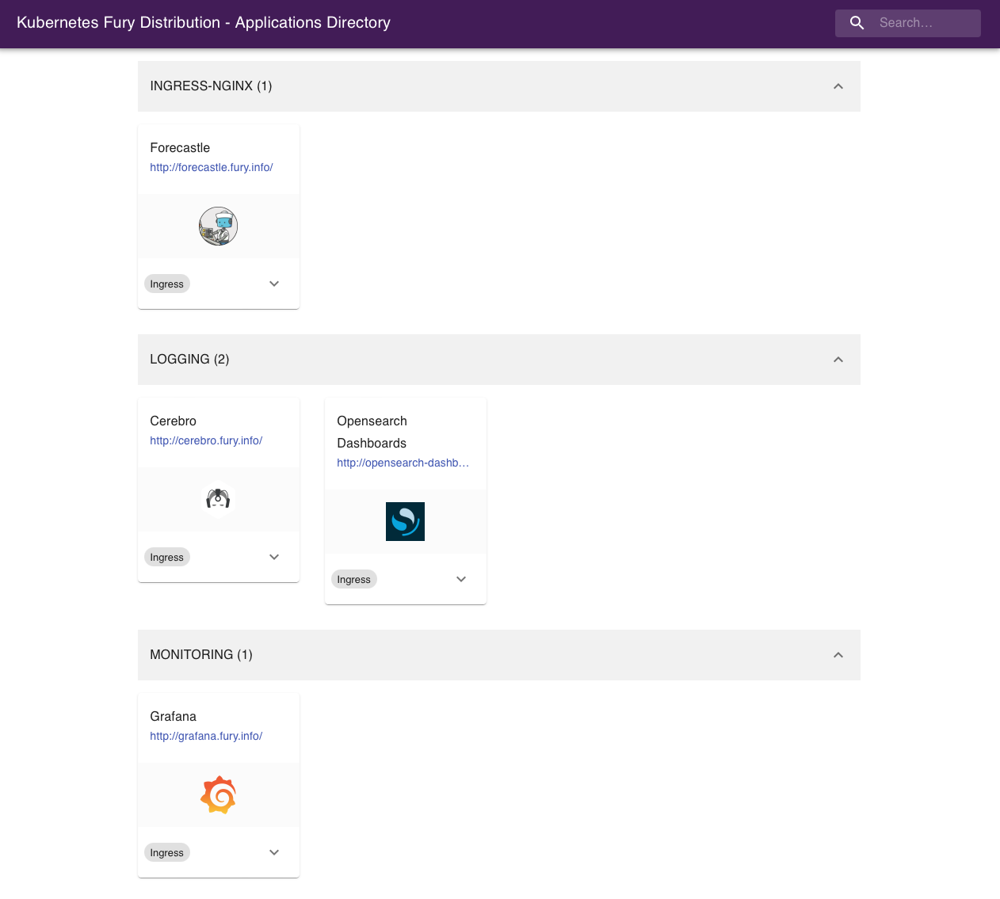
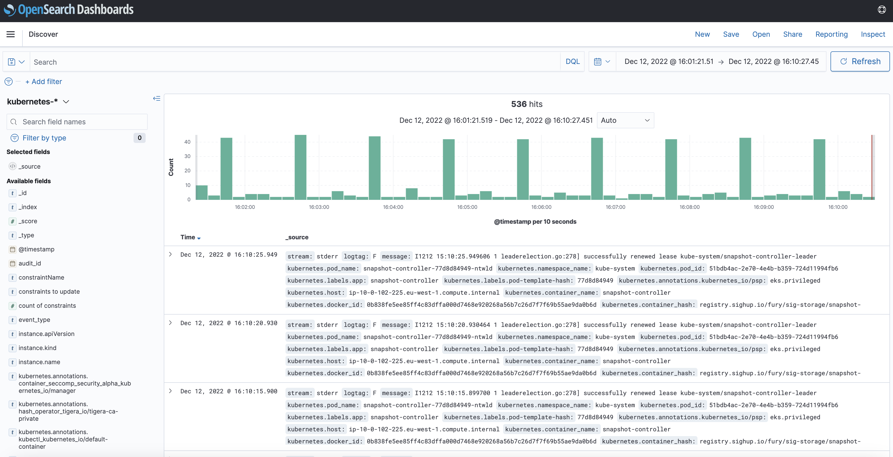

# Fury on EKS

This step-by-step tutorial guides you to deploy the **Kubernetes Fury Distribution** on an EKS cluster on AWS.

This tutorial covers the following steps:

1. Deploy an EKS Kubernetes cluster on AWS with `furyctl`
2. Download the latest version of Fury with `furyctl`
3. Install the Fury distribution
4. Explore some features of the distribution
5. (optional) Deploy additional modules of the Fury distribution
6. Teardown of the environment

> ⚠️ AWS **charges you** to provision the resources used in this tutorial. You should be charged only a few dollars, but we are not responsible for any costs that incur.
>
> ❗️ **Remember to stop all the instances by following all the steps listed in the teardown phase.**
>
> 💻 If you prefer trying Fury in a local environment, check out the [Fury on Minikube][fury-on-minikube] tutorial.

## Prerequisites

This tutorial assumes some basic familiarity with Kubernetes and AWS. Some experience with Terraform is helpful but not required.

To follow this tutorial, you need:

- **AWS Access Credentials** of an AWS Account with the following [IAM permissions][terraform-aws-eks-iam-permissions].
- **Docker** - the tutorial uses a [Docker image][fury-getting-started-dockerfile] containing `furyctl` and all the necessary tools to follow it.
- **OpenVPN Client** - [Tunnelblick][tunnelblick] (on macOS) or [OpenVPN Connect][openvpn-connect] (for other OS) are recommended.
- **AWS S3 Bucket** (optional) to store the Terraform state.
- **Github** account with [SSH key configured][github-ssh-key-setup].

### Setup and initialize the environment

1. Open a terminal

2. Clone the [fury getting started repository][fury-getting-started-repository] containing the example code used in this tutorial:

```bash
git clone https://github.com/sighupio/fury-getting-started/
cd fury-getting-started/fury-on-eks
```

3. Run the `fury-getting-started` docker image:

```bash
docker run -ti --rm \
  -v $PWD:/demo \
  registry.sighup.io/delivery/fury-getting-started
```

4. Setup your AWS credentials by exporting the following environment variables:

```bash
export AWS_ACCESS_KEY_ID=<YOUR_AWS_ACCESS_KEY_ID>
export AWS_SECRET_ACCESS_KEY=<YOUR_AWS_SECRET_ACCESS_KEY>
export AWS_DEFAULT_REGION=<YOUR_AWS_REGION>
```

Alternatively, authenticate with AWS by running `aws configure` in your terminal. When prompted, enter your AWS Access Key ID, Secret Access Key, region, and output format.

```bash
$ aws configure
AWS Access Key ID [None]: <YOUR_AWS_ACCESS_KEY_ID>
AWS Secret Access Key [None]: <YOUR_AWS_SECRET_ACCESS_KEY>
Default region name [None]: <YOUR_AWS_REGION>
Default output format [None]: json
```

You are all set ✌️.

## Step 1 - Automatic provisioning of an EKS Cluster with furyctl

`furyctl` is a command-line tool developed by SIGHUP to support:

- the automatic provisioning of Kubernetes clusters in various cloud environments
- the installation of the Fury distribution

The provisioning process is divided into two phases:

1. **Bootstrap** provisioning phase
2. **Cluster** provisioning phase

### Boostrap provisioning phase

In the bootstrap phase, `furyctl` automatically provisions:

- **Virtual Private Cloud (VPC)** in a specified CIDR range with public and private subnets
- **EC2 instance** bastion host with an OpenVPN Server
- All the required networking gateways and routes

More details about the bootstrap provisioner can be found [here][provisioner-bootstrap-aws-reference].

#### Configure the bootstrap provisioner

The bootstrap provisioner takes a `bootstrap.yml` as input. This file, instructs the bootstrap provisioner with all the needed parameters to deploy the networking infrastructure.

For this tutorial, use the `bootstrap.yml` template located at `/demo/infrastructure/bootstrap.yml`:

```yaml
kind: Bootstrap
metadata:
  name: fury-eks-demo
spec:
  networkCIDR: 10.0.0.0/16
  publicSubnetsCIDRs:
  - 10.0.1.0/24
  - 10.0.2.0/24
  - 10.0.3.0/24
  privateSubnetsCIDRs:
  - 10.0.101.0/24
  - 10.0.102.0/24
  - 10.0.103.0/24
  vpn:
    instances: 1
    port: 1194
    instanceType: t3.micro
    diskSize: 50
    operatorName: fury
    dhParamsBits: 2048
    subnetCIDR: 172.16.0.0/16
    sshUsers:
    - <GITHUB_USER>
executor:
  # state:
  #   backend: s3
  #   config:
  #     bucket: <S3_BUCKET>
  #     key: furyctl/boostrap
  #     region: <S3_BUCKET_REGION>
provisioner: aws
```

Open the `/demo/infrastructure/bootstrap.yml` file with a text editor of your choice and:

- Replace the field `<GITHUB_USER>` with your actual GitHub username
- Ensure that the VPC and subnets ranges are not already in use. If so, specify different values in the fields:
  - `networkCIDR`
  - `publicSubnetsCIDRs`
  - `privateSubnetsCIDRs`

Leave the rest as configured. More details about each field can be found [here][provisioner-bootstrap-aws-reference].

#### (optional) Create S3 Bucket to hold the Terraform remote

Although this is a tutorial, it is always a good practice to use a remote Terraform state over a local one. In case you are not familiar with Terraform, you can skip this section.

1. Choose a unique name and an AWS region for the S3 Bucket:

```bash
export S3_BUCKET=fury-demo-eks              # Use a different name
export S3_BUCKET_REGION=$AWS_DEFAULT_REGION # You can use the same region of before
```

2. Create the S3 bucket using the AWS CLI:

```bash
aws s3api create-bucket \
  --bucket $S3_BUCKET \
  --region $S3_BUCKET_REGION \
  --create-bucket-configuration LocationConstraint=$S3_BUCKET_REGION
```

> ℹ️  You might need to give permissions on S3 to the user.

3. Once created, uncomment the `spec.executor.state` block in the `/demo/infrastructure/bootstrap.yml` file:

```yaml
...
executor:
  state:
   backend: s3
   config:
     bucket: <S3_BUCKET>
     key: fury/boostrap
     region: <S3_BUCKET_REGION>
```

4. Replace the `<S3_BUCKET>` and `<S3_BUCKET_REGION>` placeholders with the correct values from the previous commands:

```yaml
...
executor:
  state:
   backend: s3
   config:
     bucket: fury-demo-eks # example value
     key: fury/boostrap
     region: eu-central-1  # example value
```

#### Provision networking infrastructure

1. Initialize the bootstrap provisioner:

```bash
cd /demo/infrastructure/
furyctl bootstrap init
```

In case you run into errors, you can re-initialize the bootstrap provisioner by adding the  `--reset` flag:

```bash
furyctl bootstrap init --reset
```

2. If the initialization succeeds, apply the bootstrap provisioner:

```bash
furyctl bootstrap apply
```

> ⏱ This phase may take some minutes.
>
> Logs are available at `/demo/infrastructure/bootstrap/logs/terraform.logs`.

3. When the `furyctl bootstrap apply` completes, inspect the output:

```bash
...
All the bootstrap components are up to date.

VPC and VPN ready:

VPC: vpc-0d2fd9bcb4f68379e
Public Subnets: [subnet-0bc905beb6622f446, subnet-0c6856acb42edf8f3, subnet-0272dcf88b2f5d12c]
Private Subnets: [subnet-072b1e3405f662c70, subnet-0a23db3b19e5a7ed7, subnet-08f4930148ab5223f]

Your VPN instance IPs are: [34.243.133.186]
...
```

In particular, take note of:

- **VPC** - `vpc-0d2fd9bcb4f68379e` in the example output above
- **Private Subnets** - `[subnet-072b1e3405f662c70, subnet-0a23db3b19e5a7ed7, subnet-08f4930148ab5223f]` in the example output above

These values are used in the cluster provisioning phase.

### Cluster provisioning phase

In the cluster provisioning phase, `furyctl` automatically deploys a battle-tested private EKS Cluster. To interact with the private EKS cluster, connect first to the private network via the OpenVPN server in the bastion host.

#### Connect to the private network

1. Create the `fury.ovpn` OpenVPN credentials file with `furyagent`:

```bash
furyagent configure openvpn-client \
  --client-name fury \
  --config /demo/infrastructure/bootstrap/secrets/furyagent.yml > fury.ovpn
```

> 🕵🏻‍♂️ [Furyagent][furyagent-repository] is a tool developed by SIGHUP to manage OpenVPN and SSH user access to the bastion host.

2. Check that the `fury` user is now listed:

```bash
furyagent configure openvpn-client \
  --list \
  --config /demo/infrastructure/bootstrap/secrets/furyagent.yml
```

Output:

```bash
2022-12-09 15:29:02.853807 I | storage.go:146: Item pki/vpn-client/fury.crt found [size: 1094]
2022-12-09 15:29:02.853961 I | storage.go:147: Saving item pki/vpn-client/fury.crt ...
2022-12-09 15:29:02.975943 I | storage.go:146: Item pki/vpn/ca.crl found [size: 560]
2022-12-09 15:29:02.975991 I | storage.go:147: Saving item pki/vpn/ca.crl ...
+------+------------+------------+---------+--------------------------------+
| USER | VALID FROM |  VALID TO  | EXPIRED |            REVOKED             |
+------+------------+------------+---------+--------------------------------+
| fury | 2022-12-09 | 2023-12-09 | false   | false 0001-01-01 00:00:00      |
|      |            |            |         | +0000 UTC                      |
+------+------------+------------+---------+--------------------------------+
```

3. Open the `fury.ovpn` file with any OpenVPN Client.

4. Connect to the OpenVPN Server via the chosen OpenVPN Client.

#### Configure the cluster provisioner

The cluster provisioner takes a `cluster.yml` as input. This file instructs the provisioner with all the needed parameters to deploy the EKS cluster.

In the repository, you can find a template for this file at `/demo/infrastructure/cluster.yml`:

```yaml
kind: Cluster
metadata:
  name: fury-eks-demo
spec:
  version: 1.24
  network: <VPC_ID>
  subnetworks:
  - <PRIVATE_SUBNET1_ID>
  - <PRIVATE_SUBNET2_ID>
  - <PRIVATE_SUBNET3_ID>
  dmzCIDRRange:
  - 10.0.0.0/16
  sshPublicKey: example-ssh-key # put your id_rsa.pub file content here
  nodePools:
  - name: fury
    version: null
    minSize: 3
    maxSize: 3 
    instanceType: t3.large
    volumeSize: 50
executor:
  # state:
  #   backend: s3
  #   config:
  #     bucket: <S3_BUCKET>
  #     key: furyctl/cluster
  #     region: <S3_BUCKET_REGION>
provisioner: eks
```

Open the file with a text editor and replace:

- `<VPC_ID>` with the VPC ID (`vpc-0d2fd9bcb4f68379e`) created in the previous phase.
- `<PRIVATE_SUBNET1_ID>` with ID of the first private subnet ID (`subnet-072b1e3405f662c70`) created in the previous phase.
- `<PRIVATE_SUBNET2_ID>` with ID of the second private subnet ID (`subnet-subnet-0a23db3b19e5a7ed7`) created in the previous phase.
- `<PRIVATE_SUBNET3_ID>` with ID of the third private subnet ID (`subnet-08f4930148ab5223f`) created in the previous phase.
- (optional) As before, add the details of the S3 Bucket that holds the Terraform remote state.

> ⚠️ if you are using an S3 bucket to store the Terraform state make sure to use a different key in `executor.state.config.key` than the one used in the boorstrap phase.

#### Provision EKS Cluster

1. Initialize the cluster provisioner:

```bash
furyctl cluster init
```

2. Create EKS cluster:

```bash
furyctl cluster apply
```

> ⏱ This phase may take some minutes.
>
> Logs are available at `/demo/infrastructure/cluster/logs/terraform.logs`.

3. When the `furyctl cluster apply` completes, test the connection with the cluster:

```bash
export KUBECONFIG=/demo/infrastructure/cluster/secrets/kubeconfig
kubectl get nodes
```

## Step 2 - Download fury modules

`furyctl` can do a lot more than deploying infrastructure. In this section, you use `furyctl` to download the monitoring, logging, and ingress modules of the Fury distribution.

### Inspect the Furyfile

`furyctl` needs a `Furyfile.yml` to know which modules to download.

For this tutorial, use the `Furyfile.yml` located at `/demo/Furyfile.yaml`:

```yaml
versions:
  networking: v1.10.0
  monitoring: v2.0.1
  logging: v3.0.1
  ingress: v1.13.1
  dr: v1.10.1
  auth: v0.0.2
  aws: v2.0.0

bases:
  - name: networking
  - name: monitoring
  - name: logging
  - name: ingress
  - name: aws
  - name: dr
  - name: opa

modules:
  - name: aws
  - name: dr
```

### Download Fury modules

1. Download the Fury modules with `furyctl`:

```bash
cd /demo/
furyctl vendor -H
```

2. Inspect the downloaded modules in the `vendor` folder:

```bash
tree -d /demo/vendor -L 3
```

Output:

```bash
$ tree -d vendor -L 3

vendor
├── katalog
│  ├── aws
│  │  ├── cluster-autoscaler
│  │  ├── ebs-csi-driver
│  │  ├── load-balancer-controller
│  │  └── node-termination-handler
│  ├── dr
│  │  ├── tests
│  │  └── velero
│  ├── ingress
│  │  ├── cert-manager
│  │  ├── dual-nginx
│  │  ├── external-dns
│  │  ├── forecastle
│  │  ├── nginx
│  │  └── tests
│  ├── logging
│  │  ├── cerebro
│  │  ├── configs
│  │  ├── logging-operated
│  │  ├── logging-operator
│  │  ├── loki-configs
│  │  ├── loki-single
│  │  ├── opensearch-dashboards
│  │  ├── opensearch-single
│  │  ├── opensearch-triple
│  │  └── tests
│  ├── monitoring
│  │  ├── aks-sm
│  │  ├── alertmanager-operated
│  │  ├── blackbox-exporter
│  │  ├── configs
│  │  ├── eks-sm
│  │  ├── gke-sm
│  │  ├── grafana
│  │  ├── kube-proxy-metrics
│  │  ├── kube-state-metrics
│  │  ├── kubeadm-sm
│  │  ├── node-exporter
│  │  ├── prometheus-adapter
│  │  ├── prometheus-operated
│  │  ├── prometheus-operator
│  │  ├── tests
│  │  ├── thanos
│  │  └── x509-exporter
│  ├── networking
│  │  ├── calico
│  │  ├── ip-masq
│  │  ├── tests
│  │  └── tigera
│  └── opa
│     ├── gatekeeper
│     └── tests
└── modules
   ├── aws
   │  ├── iam-for-cluster-autoscaler
   │  ├── iam-for-ebs-csi-driver
   │  └── iam-for-load-balancer-controller
   └── dr
      ├── aws-velero
      ├── azure-velero
      └── gcp-velero
```

## Step 3 - Installation

### Terraform project

Each module can contain Kustomize bases or Terraform modules. 

First of all, we need to initialize the additional Terraform project to create resources for DR (Velero), AWS (EBS CSI Driver).

In the repository, you can find the main.tf file `/demo/terraform/main.yml`. In this file you need to change the values for the S3 bucket that will contain the state:

```terraform
terraform {
#   backend "s3" {
#     bucket: <S3_BUCKET>
#     key: <MY_KEY> 
#     region: <S3_BUCKET_REGION>
#   }
  required_version = ">= 0.12"

  required_providers {
    aws        = "=3.37.0"
  }
}

```

Then, create a file `terraform.tfvars` with the following content (Change the values accordingly to your environment):

```terraform
cluster_name = "fury-eks-demo"
velero_bucket_name = "velero-demo-sa"
```

Then apply the terraform project:

```bash
cd /demo/terraform/

make init
make plan
make apply
```

After everything is applied, extract the kustomize patches we need in the next step with the following command:

```bash
make generate-output
```

### Kustomize project

Kustomize allows to group together related Kubernetes resources and combines them to create more complex deployments. 
Moreover, it is flexible, and it enables a simple patching mechanism for additional customization.

To deploy the Fury distribution, use the following root `kustomization.yaml` located `/demo/manifests/kustomization.yaml`:

```yaml
---
apiVersion: kustomize.config.k8s.io/v1beta1
kind: Kustomization

resources:
  - ingress
  - logging
  - monitoring
  - networking
  - dr
  - opa
  - aws
```

This `kustomization.yaml` wraps the other `kustomization.yaml`s in subfolders. For example in `/demo/manifests/logging/kustomization.yaml`

```yaml
apiVersion: kustomize.config.k8s.io/v1beta1
kind: Kustomization

resources:
  - ../../vendor/katalog/logging/cerebro
  - ../../vendor/katalog/logging/logging-operator
  - ../../vendor/katalog/logging/logging-operated
  - ../../vendor/katalog/logging/configs
  - ../../vendor/katalog/logging/opensearch-single
  - ../../vendor/katalog/logging/opensearch-dashboards

  - resources/ingress.yml

patchesStrategicMerge:
  - patches/opensearch-resources.yml
  - patches/cerebro-resources.yml
```

Each `kustomization.yaml`:

- references the modules downloaded in the previous section
- patches the upstream modules (e.g. `patches/opensearch-resources.yml` limits the resources requested by opensearch)
- deploys some additional custom resources (e.g. `resources/ingress.yml`)

Install the modules:

```bash
cd /demo/manifests/

make apply
# Due to some chicken-egg 🐓🥚 problem with custom resources you have to apply multiple times
make apply
```

## Step 4 - Explore the distribution

🚀 The distribution is finally deployed! In this section, you explore some of its features.

### Setup local DNS

In Step 3, alongside the distribution, you have deployed Kubernetes ingresses to expose underlying services at the following HTTP routes:

- `forecastle.fury.info`
- `grafana.fury.info`
- `opensearch-dashboards.fury.info`

To access the ingresses more easily via the browser, configure your local DNS to resolve the ingresses to the internal loadbalancer IP:

1. Get the address of the internal load balancer:

```bash
dig $(kubectl get svc ingress-nginx -n ingress-nginx --no-headers | awk '{print $4}')
```

Output:

```bash
...

;; ANSWER SECTION:
xxx.elb.eu-west-1.amazonaws.com. 77 IN A <FIRST_IP>
xxx.elb.eu-west-1.amazonaws.com. 77 IN A <SECOND_IP>
xxx.elb.eu-west-1.amazonaws.com. 77 IN A <THIRD_IP>
...

```

3. Add the following line to your machine's `/etc/hosts` (not the container's):

```bash
<FIRST_IP> forecastle.fury.info cerebro.fury.info opensearch-dashboards.fury.info grafana.fury.info
```

Now, you can reach the ingresses directly from your browser.

### Forecastle

[Forecastle](https://github.com/stakater/Forecastle) is an open-source control panel where you can access all exposed applications running on Kubernetes.

Navigate to <http://forecastle.fury.info> to see all the other ingresses deployed, grouped by namespace.




### Opensearch Dashboards

[Opensearch Dashboards](https://github.com/opensearch-project/OpenSearch-Dashboards) is an open-source analytics and visualization platform for Opensearch. Opensearch Dashboards lets you perform advanced data analysis and visualize data in various charts, tables, and maps. You can use it to search, view, and interact with data stored in Opensearch indices.

Navigate to <http://opensearch-dashboards.fury.info> or click the Opensearch Dashboards icon from Forecastle.

#### Read the logs

The Fury Logging module already collects data from the following indices:

- `kubernetes-*`
- `systemd-*`
- `ingress-controller-*`
- `events-*`

Click on `Discover` to see the main dashboard. On the top left corner select one of the indices to explore the logs.



### Grafana

[Grafana](https://github.com/grafana/grafana) is an open-source platform for monitoring and observability. Grafana allows you to query, visualize, alert on and understand your metrics.

Navigate to <http://grafana.fury.info> or click the Grafana icon from Forecastle.

Fury provides some pre-configured dashboards to visualize the state of the cluster. Examine an example dashboard:

1. Click on the search icon on the left sidebar.
2. Write `pods` and click enter.
3. Select the `Kubernetes/Pods` dashboard.

This is what you should see:

![Grafana][grafana-screenshot]

## Step 5 (optional) - Advanced Distribution usage

### (optional) Create a backup with Velero

1. Create a backup with the `velero` command-line utility:

```bash
velero backup create --from-schedule manifests test -n kube-system
```

2. Check the backup status:

```bash
velero backup get -n kube-system
```

### (optional) Enforce a Policy with OPA Gatekeeper

This section is under construction.

Please refer to the [OPA module's documentation][opa-module-docs] while we work on this part of the guide. Sorry for the inconvenience.

## Step 6 - Teardown

Clean up the demo environment:

1. (Required **only** if you performed the optional steps) Destroy the additional Terraform resources used by Velero:

```bash
cd /demo/terraform/
terraform destroy
```

2. Destroy EKS cluster:

```bash
cd /demo/infrastructure/
furyctl cluster destroy
```

3. Some resources are created outside Terraform, for example when you create a LoadBalancer service it will create an ELB. You can find a script to delete the target groups, load balancers, volumes, and snapshots associated with the EKS cluster using AWS CLI:

> ✋🏻 Check that the `TAG_KEY` variable has the righ value before running the script. It should finihs with the cluster name.

```bash
bash cleanup.sh
```

4. Destroy network infrastructure:

```bash
furyctl bootstrap destroy
```

5. (Optional) Destroy the S3 bucket holding the Terraform state

```bash
aws s3api delete-objects --bucket $S3_BUCKET \
  --delete "$(aws s3api list-object-versions --bucket $S3_BUCKET --query='{Objects: Versions[].{Key:Key,VersionId:VersionId}}')"

aws s3api delete-bucket --bucket $S3_BUCKET
```

6. Exit from the docker container:

```bash
exit
```

## Conclusions

Congratulations, you made it! 🥳🥳

We hope you enjoyed this tour of Fury!

### Issues/Feedback

In case your ran into any problems feel free to open an issue here on GitHub.

### Where to go next?

More tutorials:

- [Fury on GKE][fury-on-gke]
- [Fury on Minikube][fury-on-minikube]

More about Fury:

- [Fury Documentation][fury-docs]

<!-- Links -->
[terraform-aws-eks-iam-permissions]: https://github.com/terraform-aws-modules/terraform-aws-eks/blob/v17.24.0/docs/iam-permissions.md
[fury-getting-started-repository]: https://github.com/sighupio/fury-getting-started/
[fury-getting-started-dockerfile]: https://github.com/sighupio/fury-getting-started/blob/main/utils/docker/Dockerfile

[fury-on-minikube]: https://github.com/sighupio/fury-getting-started/tree/main/fury-on-minikube
[fury-on-eks]: https://github.com/sighupio/fury-getting-started/tree/main/fury-on-eks
[fury-on-gke]: https://github.com/sighupio/fury-getting-started/tree/main/fury-on-gke

[furyagent-repository]: https://github.com/sighupio/furyagent

[provisioner-bootstrap-aws-reference]: https://github.com/sighupio/fury-eks-installer/tree/master/modules/vpc-and-vpn

[tunnelblick]: https://tunnelblick.net/downloads.html
[openvpn-connect]: https://openvpn.net/vpn-client/
[github-ssh-key-setup]: https://docs.github.com/en/github/authenticating-to-github/connecting-to-github-with-ssh/adding-a-new-ssh-key-to-your-github-account

[fury-docs]: https://docs.kubernetesfury.com
[fury-docs-modules]: https://docs.kubernetesfury.com/docs/modules/
[opa-module-docs]: https://docs.kubernetesfury.com/docs/modules/opa/overview

<!-- Images -->
[grafana-screenshot]: https://github.com/sighupio/fury-getting-started/blob/media/grafana.png?raw=true
[cerebro-screenshot]: https://github.com/sighupio/fury-getting-started/blob/media/cerebro.png?raw=true

